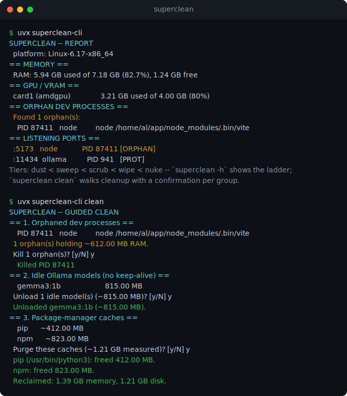

# superclean

**An agentic-dev garbage collector.** One command, a tiered cleanup ladder, that reclaims the RAM, VRAM, and disk left behind by heavy parallel development, and never touches the editors, terminals, or AI tools you have open.

[](https://pypi.org/project/superclean-cli/)


<p align="center">
  
</p>

## Quick start

```bash
uvx superclean-cli            # safe read-only report, changes nothing
uvx superclean-cli clean      # guided cleanup: confirm each proposed group
uvx superclean-cli sweep      # reclaim RAM/VRAM, kill orphaned dev servers
```

Or install it once (the command becomes `superclean`):

```bash
pipx install superclean-cli   # or: pip install superclean-cli
```

Windows, macOS, and Linux. Python 3.9+, one dependency (`psutil`). Start with the
no-arg report, preview any tier with `--dry-run`, then run it. [Full install and options below.](#install)

## Why this exists

If you build with Claude Code (or any agentic workflow), your machine looks like this: several IDE windows, a wall of terminals, a fleet of dev servers, repeated Playwright runs, and one or more local models pinned in VRAM. Most of that never cleans up after itself.

Dev servers get orphaned when their parent shell dies. Playwright leaves stale browser builds. pip, npm, uv, and pnpm caches balloon. Models stay loaded long after you stopped using them. After a few days the system runs at capacity on garbage.

`superclean` is the collector for that garbage. It tells the difference between work you are actively doing and artifacts you are done with, and only removes the second kind.

## The tiered ladder

Cleanup escalates through five additive tiers. Each includes everything lighter. A tier name describes intensity and risk, not a specific action, so the ladder is identical on every OS; each tier does what is available on the current platform and reports what it skipped.

| Command | Tier | What it adds |
|---------|------|--------------|
| `superclean` | (none) | Safe read-only **report**. Changes nothing. |
| `superclean dust` | 1 | Lightest, always-safe: temp scratch older than 14 days. |
| `superclean sweep` | 2 | + reclaim live resources: orphan-process kill, RAM/VRAM relief. |
| `superclean scrub` | 3 | + the standard deep clean: package caches (pip/npm/uv/pnpm/yarn), temp >7 days, targets.conf. |
| `superclean wipe` | 4 | + heavy and deliberate: browser caches, full temp, Playwright builds. |
| `superclean nuke` | 5 | + destructive: Docker reset, Windows.old. Requires typing `NUKE` (Windows, where the destructive actions exist; report-only on macOS/Linux). |

Risk rises with the climb: tiers 1-3 are everyday-safe, `wipe` confirms, `nuke` makes you type the word. Prefer not to pick a tier? `superclean clean` runs a guided cleanup: it diagnoses the machine, proposes each action group with measured sizes (orphans, idle models, caches, old temp, targets.conf), and runs only what you confirm. Utilities: `superclean report`, `superclean ram` (RAM/VRAM relief only, no disk), `superclean protected` (the shield list), `superclean init` (scaffold the config files), and `superclean last` (replay the previous run).

The report also shows listening TCP ports with their owning process (ports held by orphaned dev servers are flagged) and GPU/VRAM usage (NVIDIA via nvidia-smi, AMD via sysfs). On macOS, listing other users' ports requires root; the section degrades gracefully.

## The safety promise

superclean **never** kills your live tools. A generous baseline of editors, terminals, shells, and AI tools is protected by name, together with every one of their child processes, the entire ancestor chain of the running session, and any process whose command line shows it belongs to an AI agent. The tool also protects its own interpreter, so it can never flag itself. When it is unsure about a process, it leaves it alone. You add your own names in `protect.conf`.

## Platform support

| | RAM/VRAM relief | Orphan kill | Cache purge | Deep clean (browser/temp) | Destructive (Docker, Windows.old) |
|---|---|---|---|---|---|
| **Windows** | yes | yes | yes | yes | yes |
| **macOS / Linux** | yes | yes | yes | report-only (v1) | report-only (v1) |

The everyday tiers do real work everywhere: on macOS and Linux, `dust`, `sweep`, and `scrub` genuinely kill orphaned dev processes, purge package caches, unload idle models, and age out temp files. Only the heaviest, most destructive actions differ by OS: on Windows they are handled by a proven PowerShell deep-clean backend that ships with the package; on macOS and Linux that native destructive deep-cleaning (browser/page cache, docker prune) is report-only in v1 (see Roadmap).

## Install

The exact same commands work on **Windows, macOS, and Linux** (Python 3.9+).

The easiest path is [uv](https://docs.astral.sh/uv/) (zero-install, always latest).
If you do not already have `uv`:

```bash
# macOS / Linux
curl -LsSf https://astral.sh/uv/install.sh | sh
```

```powershell
# Windows (PowerShell)
powershell -ExecutionPolicy ByPass -c "irm https://astral.sh/uv/install.ps1 | iex"
```

Then, on any OS:

```bash
uvx superclean-cli              # safe read-only report, changes nothing
uvx superclean-cli clean        # guided cleanup: confirm each proposed group
uvx superclean-cli sweep        # reclaim live resources
```

Prefer a permanent install (gives you the short `superclean` command)?

```bash
pipx install superclean-cli     # macOS: brew install pipx | Debian/Ubuntu: sudo apt install pipx
# or, simplest:
pip install --user superclean-cli
```

The only dependency is `psutil` (prebuilt wheels for Windows, macOS, and Linux,
so there is nothing to compile). The package is `superclean-cli` on PyPI (the
name `superclean` was taken); the installed command is `superclean`.

## Recommended workflow

```bash
superclean                  # see what is going on, change nothing
superclean clean            # guided: confirm each proposed action group
superclean sweep --dry-run  # or preview a specific tier, then run it
```

Start at the lightest tier that solves your problem: `sweep` for "too many orphan processes and VRAM is full", `scrub` for "disk is filling up". Reach for `wipe` and `nuke` deliberately.

## Configuration

Three optional files, shared by every platform (`superclean init` copies the commented examples into your per-user config dir). superclean looks for each file via `SUPERCLEAN_CONF_DIR`, then your per-user config dir, then the bundled examples. Lines starting with `#` are comments.

- **`protect.conf`** - extra process names to never touch (one per line).
- **`targets.conf`** - extra folders to age out at `scrub` (`path|days|label`). This is where machine-specific cleanup lives so the core stays generic.
- **`services.conf`** - extra local services to health-check in the report (`label|url`). Ollama is always checked.

Each ships with commented examples, including the author's own "Albert mode" setup, to copy from.

## Scripting

Every command accepts `--json` for a stable machine-readable result (and suppresses human output), so superclean drops cleanly into pre-commit hooks, CI, or a scheduled idle-clean:

```bash
superclean report --json
superclean sweep --dry-run --json
```

Global flags: `--dry-run`, `--yes/-y`, `--i-know` (only with `nuke`), `--quiet/-q`, `--json`, `--no-color`, `--log <path>`, `--force-unlock`. Exit codes: `0` ok, `1` lock busy, `2` usage, `3` fatal.

## Logs

Every run is logged in full under your per-user data directory:

- Windows: `%LOCALAPPDATA%\superclean\`
- macOS: `~/Library/Application Support/superclean/`
- Linux: `$XDG_STATE_HOME/superclean/` (or `~/.local/state/superclean/`)

`superclean last` replays the newest mutating run from these logs.

## Safety notes

superclean deletes files and stops processes. It is built to be conservative, but you are responsible for what you run on your machine.

- Use the no-arg report and `--dry-run` first. Always.
- `wipe` clears browser caches only when the browser is closed.
- `nuke` is destructive and irreversible on Windows, where it requires typing `NUKE` by hand unless you explicitly pass `--yes --i-know`. On macOS/Linux its destructive layer is report-only in this version.
- Provided as-is, no warranty. See [LICENSE](LICENSE).

## Roadmap

- Native destructive deep-clean for macOS and Linux (page cache, `~/Library/Caches`, docker prune).
- A scheduled "garbage-collect on idle" mode.
- Per-project orphan attribution in the report.

## Development

The portable core is Python (`src/superclean/`); the Windows deep-clean backend is PowerShell (`windows/`). See [CONTRIBUTING.md](CONTRIBUTING.md).

## License

MIT. See [LICENSE](LICENSE).
